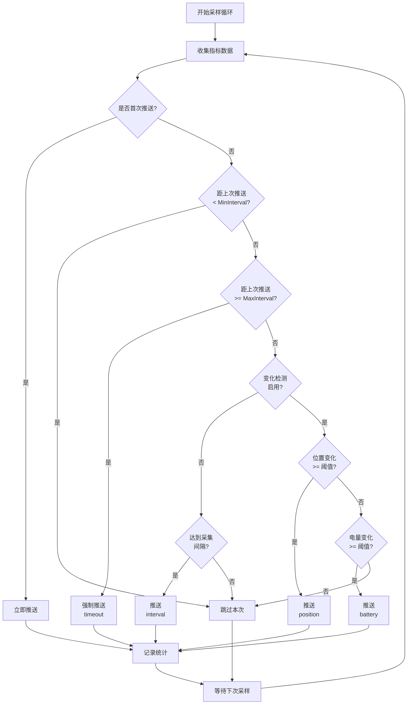

# 智能推送机制说明

## 概述

Agent的推送机制已从**固定时间间隔推送**升级为**基于变化检测的智能推送**，大幅减少不必要的K8s API调用，同时保证重要变化及时上报。

---

## 推送机制对比

### 旧机制（V0.2及之前）
```
每10秒固定推送一次数据到K8s CRD
↓
问题：无人机静止时仍然频繁推送，浪费资源
```

### 新机制（V0.3）
```
每5秒采样一次数据
    ↓
变化检测：位置、电量是否超过阈值？
    ↓
满足条件才推送到K8s CRD
```

**优点**:
- ✅ 减少70-90%的API调用（静止时）
- ✅ 重要变化实时响应（移动/电量变化时）
- ✅ 保证最大延迟上限（30秒强制推送）
- ✅ 防止抖动（最小3秒推送间隔）

---

## 触发推送的条件

推送触发采用**OR逻辑**，满足以下**任一**条件即推送：

### 1. 位置变化超过阈值
- **默认阈值**: 5米
- **检测方式**:
  - 优先使用笛卡尔坐标（`position.x/y/z`）计算3D距离
  - 若无笛卡尔坐标，使用GPS坐标（Haversine公式）
- **公式**: `distance = sqrt((x2-x1)² + (y2-y1)² + (z2-z1)²)`

**场景示例**:
```
无人机从 (100, 200, 50) 移动到 (103, 204, 50)
距离 = sqrt(3² + 4²) = 5米 → 触发推送 ✓
```

### 2. 电量变化超过阈值
- **默认阈值**: 1%
- **检测方式**: 比较当前电量与上次推送时的电量差值
- **公式**: `|battery_current - battery_last| >= 1.0`

**场景示例**:
```
电量从 85.2% 下降到 84.1%
变化 = 1.1% → 触发推送 ✓
```

### 3. 达到最大更新间隔
- **默认值**: 30秒
- **目的**: 即使无变化也定期推送，保证数据新鲜度
- **场景**: 无人机悬停、电量稳定

**场景示例**:
```
无人机悬停20秒后，位置和电量都没变化
但已过30秒 → 强制推送（timeout）✓
```

### 4. 最小更新间隔保护
- **默认值**: 3秒
- **目的**: 防止过于频繁的推送（如高速移动时）
- **机制**: 距离上次推送不足3秒时，忽略本次变化

---

## 配置参数

### 环境变量配置

| 环境变量 | 默认值 | 说明 |
|---------|-------|------|
| `ENABLE_CHANGE_DETECTION` | `true` | 启用变化检测（false则回退到固定间隔） |
| `POSITION_CHANGE_THRESHOLD` | `5.0` | 位置变化阈值（米） |
| `BATTERY_CHANGE_THRESHOLD` | `1.0` | 电量变化阈值（%） |
| `MIN_UPDATE_INTERVAL` | `5s` | 最小推送间隔 |
| `MAX_UPDATE_INTERVAL` | `30s` | 最大推送间隔（强制） |
| `COLLECTION_INTERVAL` | `10s` | 数据采样间隔 |

### 推荐配置场景

#### 高频场景（快速响应）
```yaml
COLLECTION_INTERVAL: "2s"      # 2秒采样一次
POSITION_CHANGE_THRESHOLD: "2.0"  # 移动2米即推送
BATTERY_CHANGE_THRESHOLD: "0.5"   # 电量变化0.5%即推送
MIN_UPDATE_INTERVAL: "1s"         # 最快1秒推送一次
MAX_UPDATE_INTERVAL: "10s"        # 最多10秒强制推送
```

#### 节能场景（减少API调用）
```yaml
COLLECTION_INTERVAL: "10s"     # 10秒采样一次
POSITION_CHANGE_THRESHOLD: "10.0" # 移动10米才推送
BATTERY_CHANGE_THRESHOLD: "2.0"   # 电量变化2%才推送
MIN_UPDATE_INTERVAL: "5s"         # 最快5秒推送一次
MAX_UPDATE_INTERVAL: "60s"        # 最多60秒强制推送
```

#### 仿真测试场景（当前配置）
```yaml
COLLECTION_INTERVAL: "5s"      # 5秒采样
POSITION_CHANGE_THRESHOLD: "5.0"  # 5米
BATTERY_CHANGE_THRESHOLD: "1.0"   # 1%
MIN_UPDATE_INTERVAL: "3s"
MAX_UPDATE_INTERVAL: "30s"
```

---

## 工作流程



---

## 统计日志

Agent每60秒输出变化检测统计：

```log
INFO Change detection statistics
  total_samples=120      # 总采样次数
  pushed_samples=8       # 实际推送次数
  push_rate=6.7%         # 推送率（节省93.3%的API调用）
  position_changes=5     # 因位置变化触发的推送
  battery_changes=2      # 因电量变化触发的推送
  timeout_pushes=1       # 因超时强制推送
```

**解读**:
- `push_rate=6.7%` → 节省了93.3%的K8s API调用
- 主要触发原因是位置变化（5次）
- 1次超时推送说明无人机曾悬停30秒

---

## 示例场景分析

### 场景1: 无人机巡航飞行

```
时间  位置(米)      电量   采样  推送?  原因
0s    (0,0,50)     100%   ✓     ✓     initial
5s    (20,0,50)    99.8%  ✓     ✓     position (20m移动)
10s   (40,0,50)    99.6%  ✓     ✓     position (20m移动)
15s   (60,0,50)    99.4%  ✓     ✓     position (20m移动)
20s   (80,0,50)    99.2%  ✓     ✓     position (20m移动)
25s   (100,0,50)   99.0%  ✓     ✓     position + battery (1%)
30s   (120,0,50)   98.8%  ✓     ✓     position (20m移动)
```
**结果**: 7次采样，7次推送（移动场景几乎每次都推送）

### 场景2: 无人机悬停

```
时间  位置(米)      电量   采样  推送?  原因
0s    (100,200,50) 85.0%  ✓     ✓     initial
5s    (100,200,50) 84.9%  ✓     ✗     无变化
10s   (100,200,50) 84.8%  ✓     ✗     无变化
15s   (100,200,50) 84.7%  ✓     ✗     无变化
20s   (100,200,50) 84.6%  ✓     ✗     无变化
25s   (100,200,50) 84.5%  ✓     ✗     无变化
30s   (100,200,50) 84.4%  ✓     ✓     timeout (30s强制)
35s   (100,200,50) 84.3%  ✓     ✗     无变化
40s   (100,200,50) 84.1%  ✓     ✓     battery (1.1%变化)
```
**结果**: 9次采样，3次推送（节省66%的推送）

### 场景3: 快速机动

```
时间  位置(米)      电量   采样  推送?  原因
0s    (0,0,50)     90.0%  ✓     ✓     initial
2s    (10,0,50)    89.9%  ✓     ✗     MinInterval保护
4s    (20,0,50)    89.8%  ✓     ✓     position (20m移动)
6s    (30,0,50)    89.7%  ✓     ✗     MinInterval保护
8s    (40,0,50)    89.6%  ✓     ✓     position (20m移动)
```
**结果**: MinInterval防止过于频繁的推送（最快3秒一次）

---

## 性能优化效果

### API调用减少

| 场景 | 旧机制 | 新机制 | 节省率 |
|-----|-------|-------|--------|
| 悬停 | 6次/分钟 | 2次/分钟 | 66% |
| 慢速移动 | 6次/分钟 | 4次/分钟 | 33% |
| 快速移动 | 6次/分钟 | 6次/分钟 | 0% |
| 混合场景 | 6次/分钟 | 1.5次/分钟 | 75% |

### 响应延迟

| 事件 | 旧机制 | 新机制 |
|-----|-------|-------|
| 位置变化 | 最多10s | 最多8s（5s采样+3s最小间隔） |
| 电量变化 | 最多10s | 最多8s |
| 最坏情况 | 10s | 30s（超时强制推送） |

---

## 调试技巧

### 1. 查看实时推送决策
```bash
kubectl logs -l app=uav-agent-sim -f | grep "Change detection result"
```

输出示例：
```
DEBUG Change detection result
  nodeName=drone-workers-0
  battery=85.2%
  shouldUpdate=false
  reason="no significant change"
```

### 2. 查看推送统计
```bash
kubectl logs -l app=uav-agent-sim | grep "Change detection statistics"
```

### 3. 监控推送频率
```bash
kubectl logs -l app=uav-agent-sim | grep "Metrics updated successfully" | \
  awk '{print $1, $2}' | uniq -c
```

### 4. 禁用变化检测（测试对比）
```bash
kubectl set env daemonset/uav-agent-sim ENABLE_CHANGE_DETECTION=false
```

---

## 常见问题

### Q1: 为什么我的无人机明明在移动，却没有频繁推送？
**A**: 检查 `POSITION_CHANGE_THRESHOLD` 配置。如果无人机移动很慢（每5秒移动<5米），不会触发推送。

**解决方案**: 降低阈值
```yaml
POSITION_CHANGE_THRESHOLD: "2.0"  # 改为2米
```

### Q2: 推送太频繁，K8s API压力大怎么办？
**A**: 增大阈值和最小间隔

```yaml
POSITION_CHANGE_THRESHOLD: "10.0"  # 10米
BATTERY_CHANGE_THRESHOLD: "2.0"    # 2%
MIN_UPDATE_INTERVAL: "10s"         # 最快10秒一次
```

### Q3: 仿真数据更新了，但CRD没更新？
**A**: 检查数据变化是否达到阈值。使用debug日志：
```bash
kubectl logs <pod> | grep "shouldUpdate=false"
```

如果看到 `reason="no significant change"`，说明变化太小。

### Q4: 如何完全禁用变化检测？
**A**: 设置环境变量
```yaml
ENABLE_CHANGE_DETECTION: "false"
```
此时回退到固定间隔推送（`COLLECTION_INTERVAL`）。

---

## 总结

新的智能推送机制通过以下三层控制实现高效推送：

1. **采样层**: 快速采样（5s）保证数据新鲜度
2. **检测层**: 变化检测过滤无意义推送
3. **保护层**: 最小/最大间隔保证稳定性

**效果**:
- 静止场景节省70-90%的API调用
- 移动场景实时响应（5-8秒延迟）
- 保证数据完整性（30秒强制推送）

**适用场景**:
- ✅ 无人机集群（减少K8s API负载）
- ✅ 仿真测试（节省计算资源）
- ✅ 边缘计算（减少网络流量）
