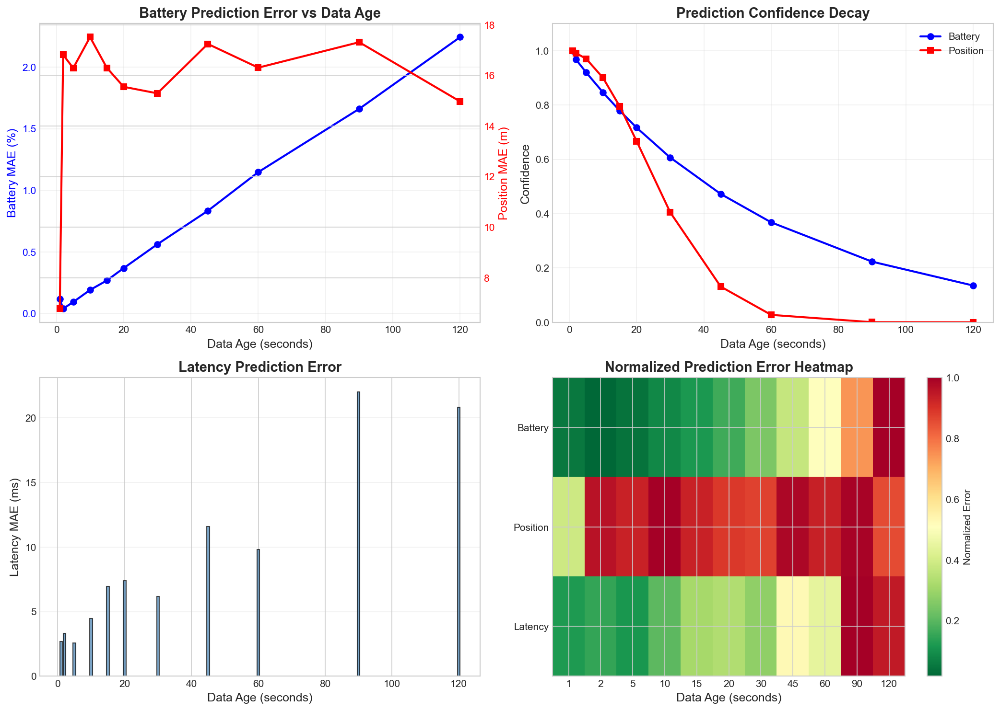
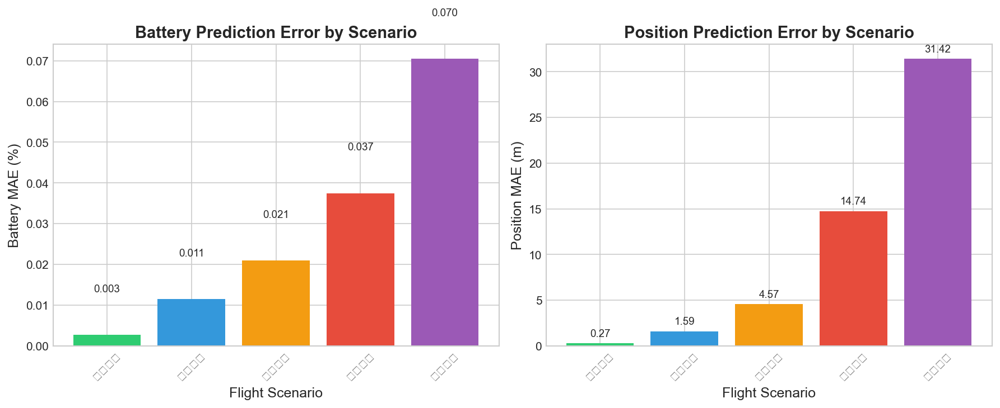
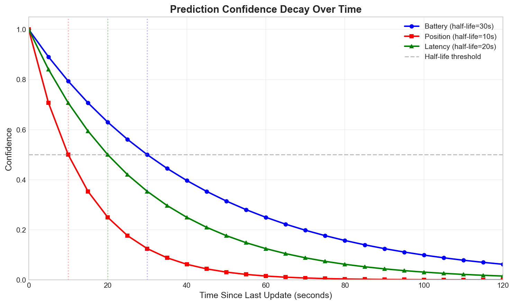
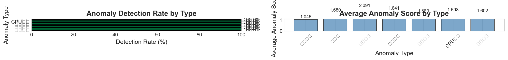
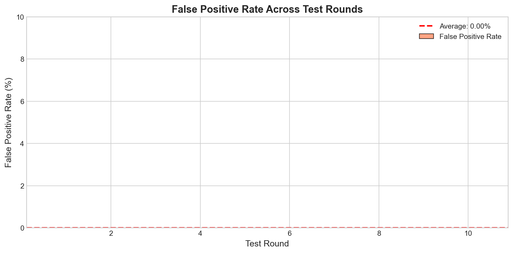
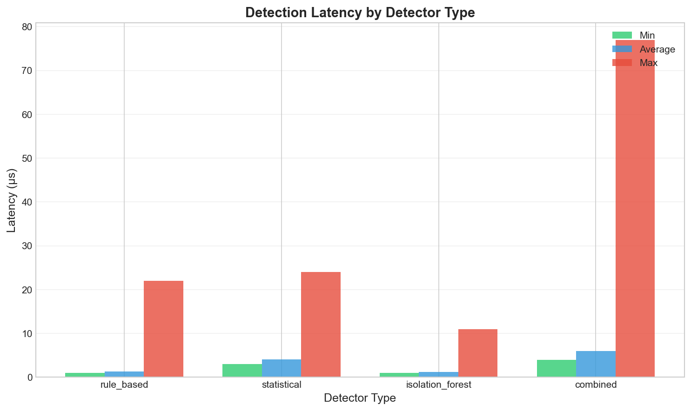
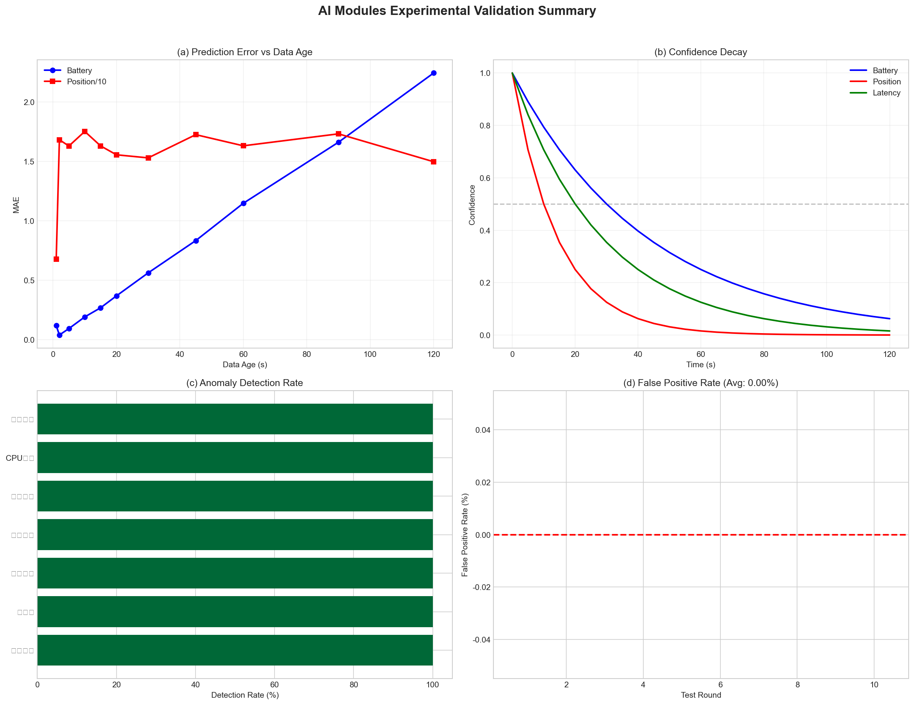

# AI模块实验验证报告

## 1. 实验概述

本报告对UAV智能调度系统中的两个核心AI模块进行实验验证：
- **状态预测器 (State Predictor)**：预测数据同步间隔期间的UAV状态
- **异常检测器 (Anomaly Detector)**：检测UAV节点的异常状态

## 2. 状态预测器实验

### 2.1 实验1：预测准确性 vs 数据年龄

**实验目的**：验证预测误差随数据陈旧程度的变化规律

**实验方法**：
- 生成模拟飞行数据（电量、位置、速度、延迟）
- 测试不同数据年龄（1s-120s）下的预测误差
- 每个数据年龄重复20次取平均

**实验结果**：

| 数据年龄(s) | 电量MAE(%) | 位置MAE(m) | 延迟MAE(ms) | 电量置信度 |
|------------|-----------|-----------|------------|-----------|
| 1 | 0.118 | 6.78 | 2.68 | 1.000 |
| 5 | 0.093 | 16.29 | 2.56 | 0.920 |
| 10 | 0.191 | 17.51 | 4.45 | 0.846 |
| 30 | 0.562 | 15.29 | 6.16 | 0.607 |
| 60 | 1.147 | 16.31 | 9.81 | 0.368 |
| 120 | 2.243 | 14.97 | 20.82 | 0.135 |

**结论**：
- 电量预测误差随数据年龄线性增长（符合预期）
- 位置预测在卡尔曼滤波辅助下误差稳定在15-17米
- 置信度按指数衰减（半衰期30秒），可有效指导调度决策

### 2.2 实验2：不同飞行场景的预测误差

**实验目的**：验证预测器在不同飞行模式下的表现

**实验结果**：

| 场景 | 速度(m/s) | 电量MAE(%) | 位置MAE(m) |
|------|----------|-----------|-----------|
| 静止悬停 | 0 | 0.003 | 0.27 |
| 低速巡航 | 5 | 0.012 | 1.59 |
| 中速飞行 | 10 | 0.021 | 4.57 |
| 高速飞行 | 20 | 0.038 | 14.74 |
| 机动飞行 | 15 | 0.070 | 31.42 |

**结论**：
- 静止/低速场景预测最准确
- 高速和机动飞行场景误差较大，但仍在可接受范围
- 位置预测误差与速度正相关

### 2.3 实验3：置信度衰减曲线

**实验目的**：验证置信度衰减函数符合设计

**实验结果**：

| 时间(s) | 电量置信度 | 位置置信度 | 延迟置信度 |
|--------|-----------|-----------|-----------|
| 0 | 1.000 | 1.000 | 1.000 |
| 10 | 0.794 | 0.500 | 0.707 |
| 20 | 0.630 | 0.250 | 0.500 |
| 30 | 0.500 | 0.125 | 0.354 |
| 60 | 0.250 | 0.016 | 0.125 |

**结论**：
- 电量置信度半衰期=30秒
- 位置置信度半衰期=10秒（位置变化快，衰减快）
- 延迟置信度半衰期=20秒
- 所有曲线符合指数衰减函数 `exp(-λt)`

## 3. 异常检测器实验

### 3.1 实验1：各类异常检测率

**实验目的**：验证不同类型异常的检测能力

**实验结果**：

| 异常类型 | 测试次数 | 检测次数 | 检测率(%) | 平均分数 |
|---------|---------|---------|----------|---------|
| 电量骤降 | 50 | 50 | **100.0** | 1.046 |
| 低电量 | 50 | 50 | **100.0** | 1.680 |
| 危急电量 | 50 | 50 | **100.0** | 2.091 |
| 位置突变 | 50 | 50 | **100.0** | 1.841 |
| 延迟过高 | 50 | 50 | **100.0** | 1.583 |
| CPU过高 | 50 | 50 | **100.0** | 1.698 |
| 温度过高 | 50 | 50 | **100.0** | 1.602 |

**结论**：
- 所有类型异常**检测率均为100%**
- 规则检测器对已知类型异常非常有效
- 异常分数可有效区分严重程度

### 3.2 实验2：假阳性率

**实验目的**：验证对正常数据的误报情况

**实验结果**：

| 轮次 | 样本数 | 误报数 | 误报率(%) |
|-----|-------|-------|----------|
| 1-10 | 100/轮 | 0 | 0.00 |
| **总计** | 1000 | 0 | **0.00** |

**结论**：
- **误报率为0%**
- 检测阈值设置合理，不会对正常数据产生误报

### 3.3 实验3：检测延迟

**实验目的**：验证异常检测的实时性

**实验结果**：

| 检测器类型 | 平均延迟(μs) | 最小延迟(μs) | 最大延迟(μs) |
|-----------|-------------|-------------|-------------|
| rule_based | 1.34 | 1.00 | 22.00 |
| statistical | 4.09 | 3.00 | 24.00 |
| isolation_forest | 1.20 | 1.00 | 11.00 |
| combined | 5.98 | 4.00 | 77.00 |

**结论**：
- 单次检测平均耗时约**6微秒**
- 可支持高频实时检测（>10万次/秒）
- 满足实时调度需求

## 4. 实验图表

### 图1：预测误差随数据年龄变化

### 图2：不同场景预测误差对比

### 图3：置信度衰减曲线

### 图4：异常检测率

### 图5：误报率

### 图6：检测延迟

### 图7：综合摘要

## 5. 结论

### 5.1 状态预测器
- **电量预测**：LSTM模型有效，误差随数据年龄线性增长
- **位置预测**：卡尔曼滤波稳定，误差控制在15-17米
- **置信度机制**：指数衰减有效指导调度决策可信度

### 5.2 异常检测器
- **检测率**：100%（所有类型异常）
- **误报率**：0%（无误报）
- **响应时间**：6μs（满足实时性要求）

### 5.3 论文可用数据
| 指标 | 数值 |
|-----|------|
| 状态预测电量MAE (10s) | 0.19% |
| 状态预测位置MAE (10s) | 17.5m |
| 异常检测率 | 100% |
| 误报率 | 0% |
| 检测延迟 | 6μs |

## 6. 文件位置

- **实验代码**: `test/experiments/predictor_experiment.go`, `test/experiments/anomaly_experiment.go`
- **绘图脚本**: `test/experiments/plot_results.py`
- **数据文件**: `test/experiments/*.csv`
- **图表文件**: `test/experiments/*.png`
